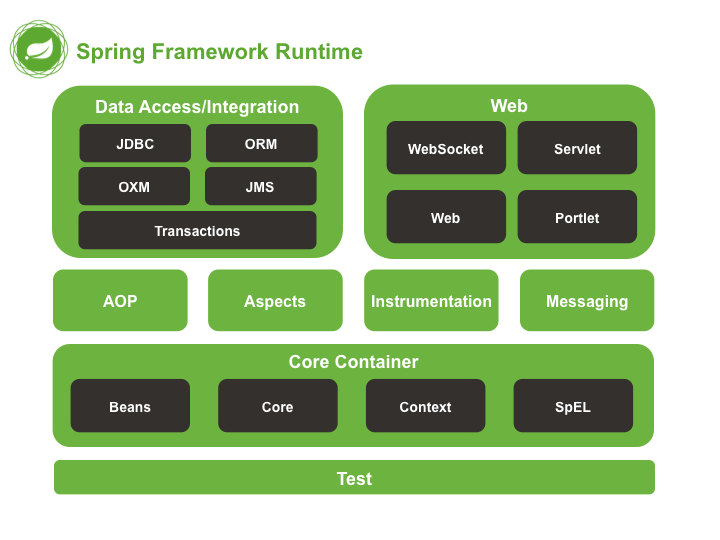

# Spring 筆記

# 物件導向程式設計

## 耦合度( Coupling)

低耦合：方便維護與管理。

## Spring Framework

以 IoC (Inversion of Control) 與 AOP (Aspect-Oriented Programming) 為主要設計理念。

## Inversion of Control

控制反轉，降低應用程式元件之間的相依關係，進而降低耦合度。

通過 Dependency Injection 實現。

## Aspect-Oriented Programming

不更改原始程式碼的情況下插入特定功能的程式碼。(Logging, Securety…)



## XML 組態 難用

## annotation 組態 好用，但需要寫入原始碼。

需要宣告@Configuration 和 @ComponentScan，或是放在 Base Package 之下(Starter Class的目錄)

Starter Class: @SpringBootApplication、main方法、整個專案唯一的啟動類別。

## Java 類別組態，可自定義。

放在 Base Package，POJO類別，需要宣告@Configuration在類別前和 @Bean 在方法前

## Java Bean 需實作 [java.io.Serializable](https://docs.oracle.com/en/java/javase/21/docs/api/java.base/java/io/Serializable.html)

## Bean 元件的 Scope

需要 Spring Web Context 支持。

singleton: 預設值，呼叫getBean() 時使用相同 id 會取得相同物件。
Bean

prototype: 呼叫 getBean() 時使用相同 id 會取得全新物件。

request: HTTP request 內使用相同 id 會取得相同物件。
session: HTTP session 內使用相同 id 會取得相同物件。

## Bean 元件的初始化

@PostConstruct: 要求 Spring 在完成所有 @Autowired 注入後執行相關程式碼

## Bean 元件的毀滅

@Predestroy: 要求 Spring 在 Bean Container 關閉前執行毀滅物件相關程式，只會作用在 singleton

## Java 的 i18n

檔名.properties、 key = value #註解、classpath = /src/main/resources

```java
String baseName = “i18n.Messages”;
ResourceBundle bundle = ResourceBundle.getBundle(baseName, Locale.US);
String value = bundle.getString("key");
```

## DataSource

Spring 使用 DataSource 來取代傳統的 DriverManager，目的是利用 Connection Pool 來提升連接的和資源使用的效率。

Spring Boot 的 Connection Pool 默認使用 HikariCP。

## @PersistenceContext

SessionFactory是 thread-safe，Session則否。因此當需要使用 SessionFactory 時使用 @autowired 注入。當需要 Session 物件或是 EntityManager 物件時，使用 @PersistenceContext 來取代 @Autowired。

## Spring Transaction Management

程式設計式：適用於只有少量交易的情況，使用 TransactionTemplate 與 PlatformTransactionTemplate 撰寫程式呼叫 commit() rollback() 管理交易。

宣告式：適用於大量交易，使用 XML 或 annotation 方式宣告 transaction 管理規則。

## Transaction 的自動設定

在 Java 類別組態宣告 @EnableTransactionManagement (Spring Boot 預設行為)，Service、DAO 使用 @Transactional

@Transactional 可以宣告在類別或方法。

peropagation behavier 預設為 REQUIRED，其他行為參照 Spring 講義p.115

## Spring Data JPA

應用於使用**關聯式資料庫**的專案，可以簡化使用 Java Persistence API 技術撰寫 DAO的工作。

Spring Data JPA 通過自定義的 Repository 介面繼承 JpaRepository 內基本的CRUD方法。Spring Data JPA 使用 JPA 規範，而 Hibernate 作為 JPA 最常見的實作，負責處理 ORM，從而簡化了和 JDBC Driver (由各家資料庫廠商提供)的互動，從而生成SQL語句或是建立連線。

## [JpaReopsitory](https://docs.spring.io/spring-data/jpa/docs/current/api/org/springframework/data/jpa/repository/JpaRepository.html) extends [ListCrudRepository](https://docs.spring.io/spring-data/commons/docs/current/api/org/springframework/data/repository/ListCrudRepository.html) extends [CrudRepository](https://docs.spring.io/spring-data/commons/docs/current/api/org/springframework/data/repository/CrudRepository.html) extends Repository

## [CrudRepository](https://docs.spring.io/spring-data/commons/docs/current/api/org/springframework/data/repository/CrudRepository.html) (非常重要!!!)

`<S entends T>` S save (S entity)：若 ID 為 null 或 ID 不存在資料庫則新增，否則修改。

boolean existsById(ID id)：檢查資料是否存在。

long count()：總資料筆數。

void delete(T entity)：刪除資料。

void deleteById(ID id)：用 id 刪除資料。

[Iterable<T>](https://docs.oracle.com/en/java/javase/21/docs/api/java.base/java/lang/Iterable.html) findall()：取得所有資料

[Iterable<T>](https://docs.oracle.com/en/java/javase/21/docs/api/java.base/java/lang/Iterable.html) findById(Iterable<ID> ids)：取得所有符合 Primary Key 名單的資料 

[Optional<T](https://docs.oracle.com/en/java/javase/21/docs/api/java.base/java/util/Optional.html)> findById(ID id)：使用 PK 取得一筆資料，可以在不確定資料是否存在的情況下使用。(eager loading)

Optional 的方法需要深入研究

## [ListCrudRepository](https://docs.spring.io/spring-data/commons/docs/current/api/org/springframework/data/repository/ListCrudRepository.html)

List<T> findAllById：return type difference。

List<T> findall()：return type difference。

## [JpaRepository](https://docs.spring.io/spring-data/jpa/docs/current/api/org/springframework/data/jpa/repository/JpaRepository.html#getReferenceById(ID))

void flush()：把修改傳送到資料庫。

`<S extends T> S saveAndFlush (S entity)`:save + flush

T getReferenceById(ID id)：使用 PK 找到一筆資料，存在的情況使用 lazy loading，不存在則丟出 EntityNotFoundException。

## Query Method

1. 使用方法名稱產生SQL指令(要記憶額外的語法)
2. 使用 @Query 宣告的 JPQL 產生 SQL 指令 (可能被掃碼回報)
3. Criteria Query 不會被回報，但非常 verbose。

## [HTTP](https://datatracker.ietf.org/doc/html/rfc2616)

```jsx
HTTP Request

Method Request-URI HTTP/1.1
header1: value1
header2: value2
header3: value31, value32, value33
header4: value4
 
[ message-body ]

Method：GET、POST、PUT、DELETE

---------------------------------------------
HTTP Response

HTTP/1.1 Status-Code Reason-Phrase
header1: value1
header2: value2
header3: value31, value32, value33
header4: value4
 
[ message-body ]

Status-Code：	404		500
Reason-Phrase：	Not Found	Internal Server Error
---------------------------------------------

```

### HTTP Method

Get：URL會有 query string

?name1=value1&name2=value2&name3=value3…

Post：query string 藏在Message Body內

其他的是Browser在用的。

### Status Line = status code(404) + reason phase(NOT FOUND)

textarea/file 要用 post 不可用 get (URL有長度限制)

Header field 可以在 Java 以參數型式呼叫，具體種類需參考 HTTP文件。

Servlet 規格規定 WEBINF 內的檔案無法由 Browser 取得(安全性考量)

## Controller的功能

1. 接收資料
2. 轉換資料
3. 驗證資料
4. 呼叫企業邏輯
5. 根據執行結果呼叫 View

## [**Package org.springframework.web.servlet**](https://docs.spring.io/spring-framework/docs/6.2.0/javadoc-api/org/springframework/web/servlet/package-summary.html)

[DispatcherServlet](https://docs.spring.io/spring-framework/docs/6.2.0/javadoc-api/org/springframework/web/servlet/DispatcherServlet.html) Class 是核心組件，負責請求的分派與協調，無直接業務邏輯功能。

輔助其發揮作用的 Interface：

HandlerMapping：DispatcherServlet → Controller

ViewResolver：DispatcherServlet → View

其他的參照 API 文件

## InternalResourceViewResolver

對@Controller方法回傳值加工

spring.mvc.view.prefix + @Controller方法回傳值 + spring.mvc.view.suffix

## View

每一個靜態或動態網頁都需要搭配一個相對應的 handler method (@Controller) 才可以使用 Browser 呼叫。

## 內嵌式 Web Container 以 port 區分，外部 Web Container 以專案名稱區分

內嵌式 Web Container 的設定位置在 application.properties

可使用 server.servlet.context-path 來模擬外部 Web Container 的使用情境。

要使用外部 Web Container 必須以 war 格式來產生專案。

spring-boot-starter-tomcat 的 scope 在開發時設定為 provided ，正式上線則不需要。

## Controller

可以使用任意方法名稱、接收任意數量的方法參數，但方法參數型別及回傳型別有規定。需參照 [Method Arguments](https://docs.spring.io/spring-framework/reference/web/webmvc/mvc-controller/ann-methods/arguments.html) 文件。

注意！要嘛 1. 不要定義屬性 2. 若定義屬性則必須使用 @Autowired，不可自行塞值。(thread-unsafe)

@XxxMapping 的 path 屬性合法值有兩種，條件嚴格的優先於條件寬鬆的。

1. /path/…. URL完全符合時呼叫
2. /path/** 前面符合時呼叫
3. /path/* 只有一層

@RequestMapping 可以宣告在 class 上，功能類似 prefix。

## Controller 兩種呼叫 View 的方式

| **Forward** | **Redirect** |
| --- | --- |
| 一個 request | 多個 request |
| 網址 controller | 網址 view |
| controller 和 view 為同一應用程式 | controller 和 view 可為不同應用程式 |

## 取得 HTTP Request 傳送的資料

@RequestParam 將 HTTP Request 傳送的 HTML Form 資料與 handler method 參數綁定。若不確定是否存在則 required 應設為 flase。綁定失敗則 handler method 不會執行。

假設 HTML Form 資料: name1=value1&name2=value2

```java
public String handlerMethod(
	@RequestParam(name1="name1") String data1,
	@RequestParam(name2="name2") String data2,){
	// data1 儲存 value1
	// data2 儲存 value2	
}
```

```java
public String handlerMethod(String name1, String name2){
}
```

```java
public String handlerMethod(
	@RequestParam Map<String,String> param){
	// param 儲存 name1=value1 以及 name2=value2
}
```

## 常見的 HTTP Request Header

參照講義 p.108

使用@RequestHeader 綁定參數，若不確定是否存在則 required 應設為 flase。綁定失敗則 handler method 不會執行。

## HttpSession

Servlet 規格中稱為 Session Scope，橫跨多個 request。其運作原理類似置物櫃與號碼牌的概念。

使用 void setAttribute(String name, Object value) 來存入

使用 Object getAttribute(String name) 來讀取

使用 void removeAttribute(String name) 來刪除

使用@SessionAttribute 綁定參數，若不確定是否存在則 required 應設為 flase。綁定失敗則 handler method 不會執行。

## [HTTP Cookie](https://datatracker.ietf.org/doc/html/rfc6265)

存在 Browser 端，詳細屬性參照講義 p.116

使用@CookieValue 綁定參數，若不確定是否存在則 required 應設為 flase。綁定失敗則 handler method 不會執行。

## Modle

僅存活於相同的 HTTP Request。

使用 Model addAttribute(String name, Object value) 來存入

使用 Object getAttribute(String name) 來存入

使用@RequestAttribute 綁定參數，若不確定是否存在則 required 應設為 flase。綁定失敗則 handler method 不會執行。

## 檔案上傳

```html
<form method="post" enctype="multipart/form-data" action="/controller/upload">
	<p>檔案:<input type="file" name="file"></p>
	<p>說明:<input type="text" name="description"></p>
	...
	<p><input type="submit" value="upload"></p>
</form>
```

使用 @RequestPart 綁定，若不確定是否存在則 required 應設為 flase。綁定失敗則 handler method 不會執行。

常用方法參照講義 p.125

getBytes() 全部載入到記憶體，太大會出事(建議 max 2MB)

application.properties可以自定義:

spring.servlet.multipart.max-file-size=單一檔案大小上限

spring.servlet.multipart.max-request-size=單一 request 大小上限

## @ModelAttribute

可宣告在方法或是方法參數上

宣告在方法：方法在 handler method 方法執行之前執行，用來將 handler method 需要的資料塞入 Model 物件。可以宣告所有 handler method的合法參數，不可以使用 @XxxMapping 標註、必須回傳 void，這個 Controller 的所有 handler method 執行之前會先執行此方法。

宣告在方法參數：製作 Form-backing Bean 並使用宣告的名稱將 Form-backing Bean 塞入 Model 物件。

@ControllerAdvice 宣告在類別，Scope 是所有的 @Controller

@ModelAttribute 宣告在方法上類似於 html 在 <style> 標籤內宣告 css 樣式，範圍僅限於當前檔案。@ControllerAdvice 宣告在類別類似於一個獨立的 css 檔，範圍套用於整個專案。

## Thymeleaf

Thymeleaf 是 Server 端的網頁樣板處理器 (template engine) 本章節著重於 html 的渲染

若看見 There was an unexpected error (type=Internal Server Error, status=500).
An error happened during template parsing 則大概率是 thymeleaf 語法錯誤。

### Thymeleaf 在 application.properties 中的設定

spring.thymeleaf.enabled=true #想不到任何改為 false 的理由

spring.thymeleaf.encoding=UTF-8 #須設定為和 eclipse 相同的編碼，否則衝突。

spring.thymeleaf.mode=HTML #檔案處理模式

spring.thymeleaf.prefix=classpath:/templates/ #網址前綴，這裡使用的是預設值。

spring.thymeleaf.prefix=.html #網址後綴，這裡使用的是預設值。

為了避免轉址變為 classpath:/templates//xxx.html 應該將預設 suffix 後面的 / 拿掉。

## 常見的 thymeleaf 語法

Thymeleaf 須寫在標籤內，例如：<h3 th:text=””> <span th:utext=””>(不會自動跳脫字元，儘可能避開，JS 注入風險) <a th:href> <th:block th:text=””>

### #{…} 適用於讀取 Java properties 多國語系資料

假設 Java properties 包含資料：

global.title=產品系統(測試用)

error.maxlength=長度不得超過{0}個字

```html
<h3 th:text=”#{global.title}”>title</h3>

<h3 th:text=”#{error.maxlength(20)}”>error</h3>
```

### @{…} 適用於處理超連結

1. <a>、<link> 標籤的 th:href 屬性
2. <script>、 標籤的 th:src 屬性
3. 當使用 / 開頭的相對路徑時會自動在路徑前面加上 Context Path
4. query string 不以&隔開，改用 ,

```html
<a th:href="@{/product(id=${id},name=${name})}">product</a>
<!-- 可能產生 "/appname/product?id=1&name=Coca+cola" -->
<a th:href="@{/product/{pid}/details(pid=${data})}">product</a>
<!-- 可能產生 "/appname/product/2/details" -->
```

## ${} 其他

1. ${name} 取得 Request Scope 內的的物件，相當於@RequestAttribute。
2. ${bean.name}呼叫物件的 getter 方法。
3. 撰寫網頁程式邏輯

```html
<h3 th:text="|Today is ${date}|"></h3>
<!-- 類似 JS 的 `` -->
<h3 th:text="${errors ne null and not errors.isEmpty() ? errors : 'no errors'}"></h3>
<h3 th:text="${bean2 ?: 'bean2=null'}"></h3>
```

1. 呼叫物件任意方法(return 不可 void)或是參數

```html
<h3 th:text="${map ne null and map.containsKey('id') ? map.id : ''}"></h3>
${session.name} <!-- 相當於 HttpSession,getAttribute("name") -->
${application.name} <!-- 相當於 ServletContext.getAttribute("name") -->
${param.name} <!-- 相當於 HttpServletRequest.getParamater("name") -->
```

1. [ ]比 . 更泛用，例如使用 index 獲取 Collection 或 Array 的元素 ${data[0]}
2. [Thymeleaf](https://www.thymeleaf.org/doc/tutorials/3.1/usingthymeleaf.html#appendix-b-expression-utility-objects) 提供多個工具物件可以透過 ${#物件名稱} 語法呼叫例如 #lists #arrays #aggregates

## th:if  th:unless

| boolean |  not null | true | true |
| --- | --- | --- | --- |
| number/char | not null | 不是 0 | true |
| String | not null | 不是”false”,”off”,”no” | true |
| 其他型別 | not null |  | true |

## th:each = for loop

## inline [[]] 對應 th:text [()] 對應 th:utext]]

## Spring Boot 的 多國語系(i18n)

**org.springframework.web.servlet.LocaleResolver**

LocaleResolver 可以從 HTTP Request, Session, Cookie 等來源取得 Locale 資訊

預設為 AcceptHeaderLocaleResolver，但只是唯讀。

可以使用 LocaleContextHolder.getLocale() 來回傳 Locale 物件

1. 使用 Java properties file 儲存多國語系資料

/src/main/resources/i18n/Messages.properties
form.name.required=i18n
/src/main/resources/i18n/Messages_en_US.properties
form.name.required=i18n (en_US)
/src/main/resources/i18n/Messages_zh_TW.properties
form.name.required=i18n (zh_TW)

1. [application.properties](http://application.properties) 修改多國語系自動設定預設值

spring.messages.basename=i18n.Messages
spring.messages.encoding=UTF-8
spring.messages.fallback-to-system-locale=false

1. 使用 MessageSource 取得不同語系的文字資料

```java

```

[](https://www.notion.so/1629ffe5ea1080deabede660e6416fa1?pvs=21)
